# Penjelasan

- Nama: Andreas Reynard Samsico
- NRP: 5025221020
- Kelas: PBKK D

Berikut ini saya akan menjelaskan beberapa fitur pada tiap halaman web dalam berbagai bentuk.

## Halaman rute '/'

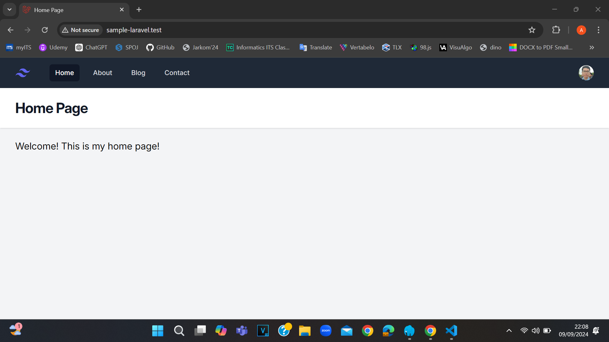

Rute halaman ini menggambarkan laman _home page_ dari web yang telah dibuat menggunakan Laravel. Pada bagian atas terdapat navbar yang merupakan link menuju halaman Home, About, Blog, dan Contact. Tidak ada sesuatu yang khusus di halaman ini.

## Halaman rute '/about'

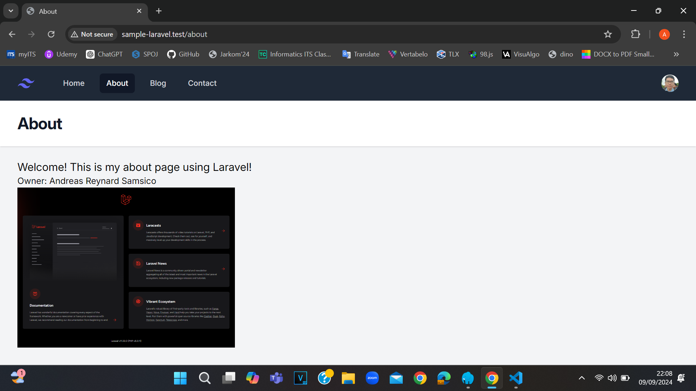

Rute halaman ini menggambarkan laman _about_ dari web ini yang juga mempunyai navbar yang sama (ini juga berlaku untuk halaman blog dan contacts). Selain terdapat informasi pemilik web ini, juga terdapat _screenshot_ halaman welcome.blade.php yang berada di dalam repository resources/views, menandakan bahwa Instalasi Laravel sudah berhasil.

## Halaman rute '/posts'

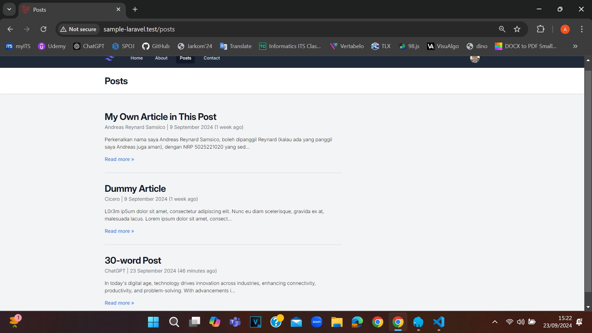

Rute halaman ini menggambarkan laman _posts_ dari web Laravel ini yang isinya memuat 2 buah artikel. Artikel berjudul "__My Own Article in This Post__" mencertitakan tentang diri saya sendiri dan ucapan terima kasih, sedangkan yang berjudul "__Dummy Article__" hanyalah 1 buah paragraf _lorem ipsum_. Namun pada halaman posts utama ini, isi dari tiap artikel dibatasi sebanyak 150 karakter, sehingga jika ingin melihatnya secara keseluruhan, maka ada keharusan untuk klik tulisan judul atau "__Read more >>__" tiap artikel dan nantinya masuk ke laman _single post_ pada artikel tersebut. Perhatikan gambar-gambar di bawah ini untuk melihat tampilan web rute '/posts/judul-artikel-1' dan '/posts/judul-artikel-2'. Klik "__<< Back to post__" untuk kembali ke menu posts utama tadi.

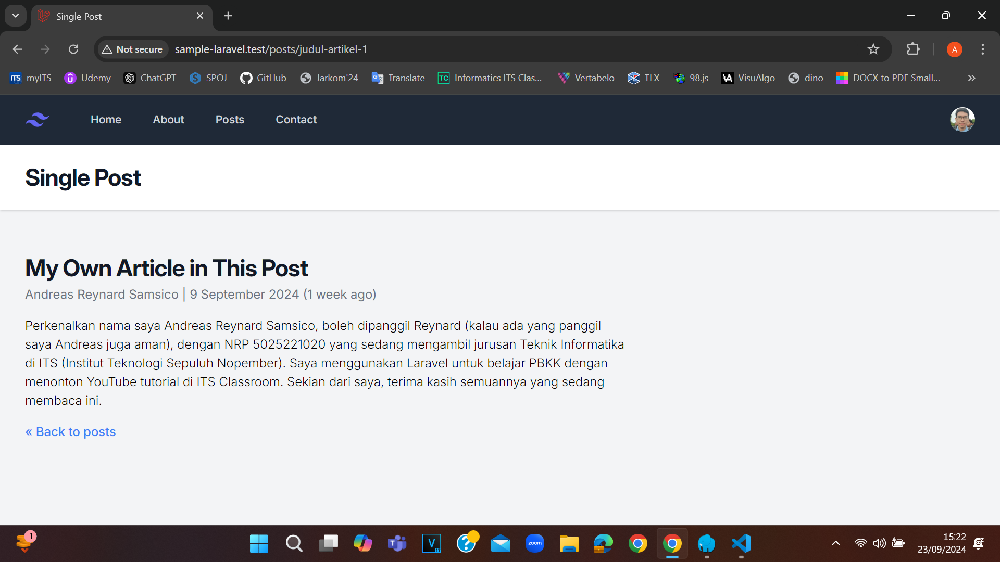

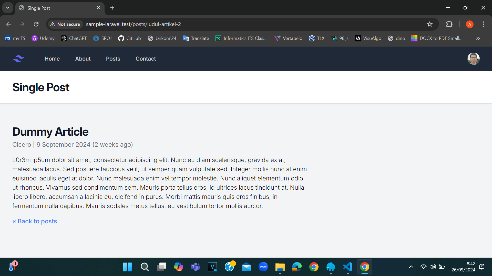

Namun selain rute-rute di atas, dikarenakan adanya abort(404), pastinya web tujuan aslinya akan dialihkan menuju ke rute '/404' yang terbaca "__404 | NOT FOUND__", seperti gambar di bawah.

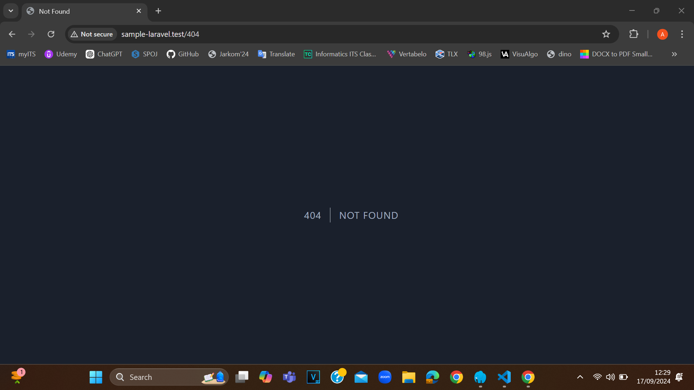

## Halaman rute '/contact'

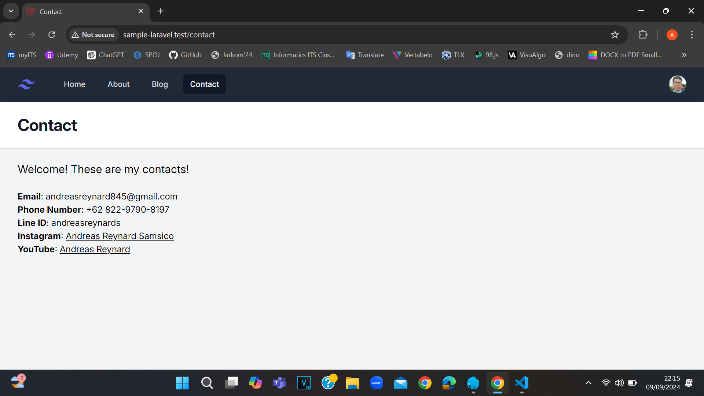

Rute halaman tersebut menggambarkan laman _contact_ dari web ini yang isinya merupakan Email, nomor HP/WA, ID Line, akun Instagram, dan channel YouTube pribadi. Kata-kata yang digarisbawahi (yang 2 terakhir) dapat diklik menuju link masing-masing.

## Dropdown

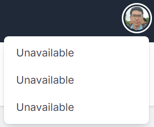

Navbar pada web ini juga mempunyai dropdown yang dimana setelah gambar diri saya diklik akan muncul 3 link yang hingga saat ini belum ada fungsinya (rute '/#').

## Halaman web dalam bentuk Mobile

__Catatan__: Pada gambar-gambar di bawah ini bagian kiri adalah laman web dan bagian kanan adalah Visual Studio Code.

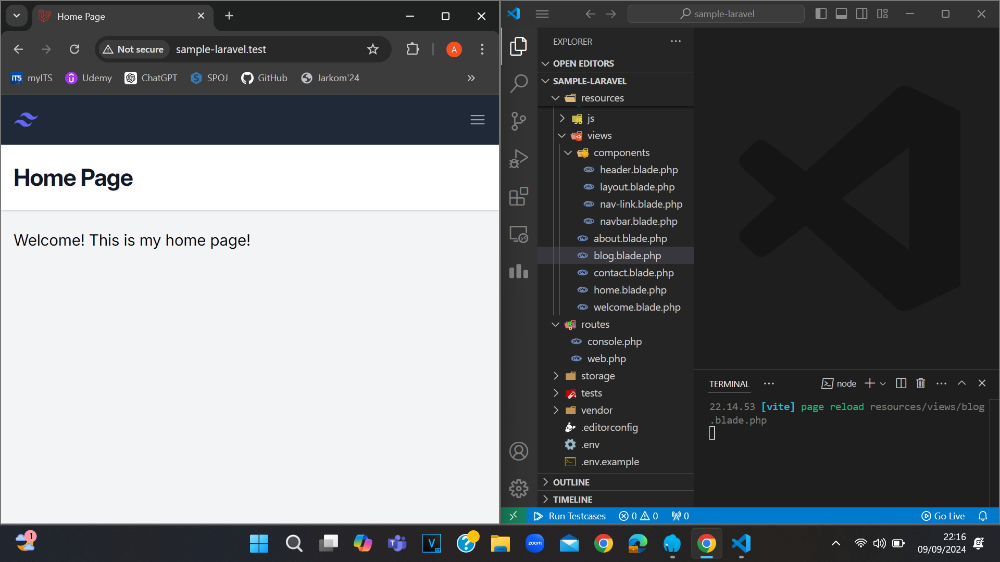

Gambar di atas menunjukkan bahwa jika seseorang membuka laman web di perangkat mobile, misalnya HP, maka tampilan web akan terlihat berbeda dari aslinya.

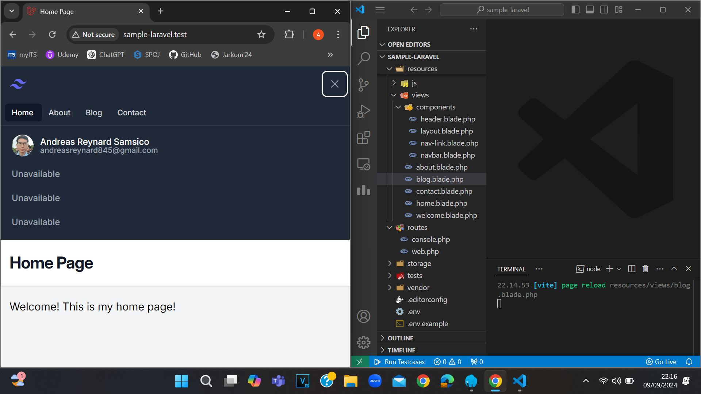

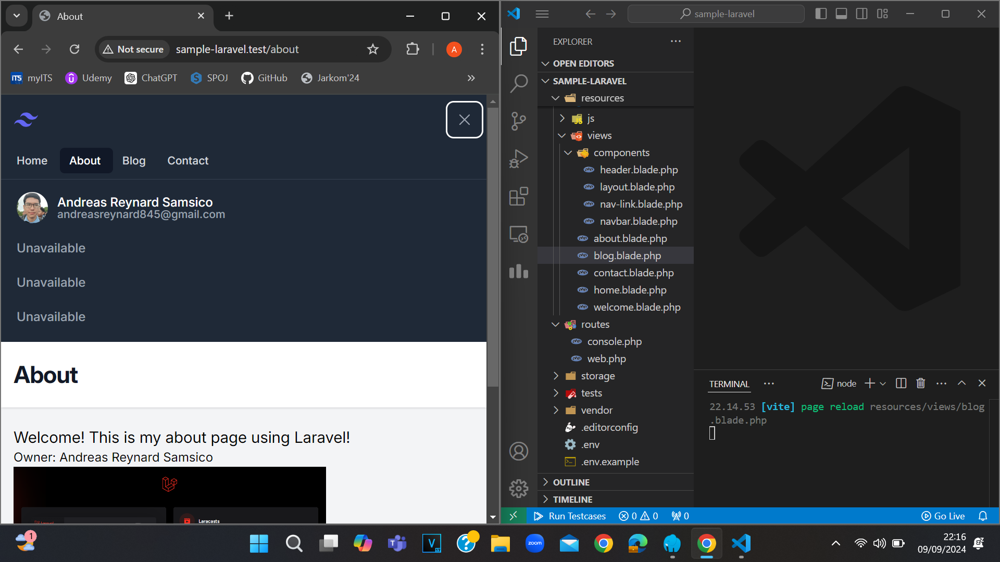

Pengguna perangkat mobile harus menekan 3 garis horizontal kecil di kanan atas untuk mengakses ke halaman web lain. Setelah itu, dapat terlihat navbar khusus yang terdiri dari pilihan halaman web yang sama, gambar diri saya, nama lengkap, Email, dan 3 link yang belum berfungsi seperti 2 contoh gambar di atas. Tekan tanda silang di kanan atas untuk menghilangkannya.

# Laravel

## About Laravel

Laravel is a web application framework with expressive, elegant syntax. We believe development must be an enjoyable and creative experience to be truly fulfilling. Laravel takes the pain out of development by easing common tasks used in many web projects, such as:

- [Simple, fast routing engine](https://laravel.com/docs/routing).
- [Powerful dependency injection container](https://laravel.com/docs/container).
- Multiple back-ends for [session](https://laravel.com/docs/session) and [cache](https://laravel.com/docs/cache) storage.
- Expressive, intuitive [database ORM](https://laravel.com/docs/eloquent).
- Database agnostic [schema migrations](https://laravel.com/docs/migrations).
- [Robust background job processing](https://laravel.com/docs/queues).
- [Real-time event broadcasting](https://laravel.com/docs/broadcasting).

Laravel is accessible, powerful, and provides tools required for large, robust applications.

## Learning Laravel

Laravel has the most extensive and thorough [documentation](https://laravel.com/docs) and video tutorial library of all modern web application frameworks, making it a breeze to get started with the framework.

You may also try the [Laravel Bootcamp](https://bootcamp.laravel.com), where you will be guided through building a modern Laravel application from scratch.

If you don't feel like reading, [Laracasts](https://laracasts.com) can help. Laracasts contains thousands of video tutorials on a range of topics including Laravel, modern PHP, unit testing, and JavaScript. Boost your skills by digging into our comprehensive video library.

## Laravel Sponsors

We would like to extend our thanks to the following sponsors for funding Laravel development. If you are interested in becoming a sponsor, please visit the [Laravel Partners program](https://partners.laravel.com).

### Premium Partners

- **[Vehikl](https://vehikl.com/)**
- **[Tighten Co.](https://tighten.co)**
- **[WebReinvent](https://webreinvent.com/)**
- **[Kirschbaum Development Group](https://kirschbaumdevelopment.com)**
- **[64 Robots](https://64robots.com)**
- **[Curotec](https://www.curotec.com/services/technologies/laravel/)**
- **[Cyber-Duck](https://cyber-duck.co.uk)**
- **[DevSquad](https://devsquad.com/hire-laravel-developers)**
- **[Jump24](https://jump24.co.uk)**
- **[Redberry](https://redberry.international/laravel/)**
- **[Active Logic](https://activelogic.com)**
- **[byte5](https://byte5.de)**
- **[OP.GG](https://op.gg)**

## Contributing

Thank you for considering contributing to the Laravel framework! The contribution guide can be found in the [Laravel documentation](https://laravel.com/docs/contributions).

## Code of Conduct

In order to ensure that the Laravel community is welcoming to all, please review and abide by the [Code of Conduct](https://laravel.com/docs/contributions#code-of-conduct).

## Security Vulnerabilities

If you discover a security vulnerability within Laravel, please send an e-mail to Taylor Otwell via [taylor@laravel.com](mailto:taylor@laravel.com). All security vulnerabilities will be promptly addressed.

## License

The Laravel framework is open-sourced software licensed under the [MIT license](https://opensource.org/licenses/MIT).
